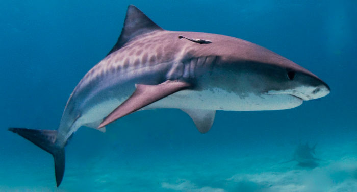

# Ironhack Bootcamp First Project: Data Cleaning Pandas

## Basic information
* **Project Author**: Sergi Portolés. 
* This project is based on the data extracted from: The [Global Sharks Attacks](https://www.kaggle.com/datasets/teajay/global-shark-attacks) database.
* This project does not use any type of stadistical analysis and it is mearly based on data visualization after a process of cleaning and text normalization.
## Main Objective
The main objective of this project is to find differences in the behaviour or the outcome of shark attacks depending on the species.
## Results Summary
### Shark Attacks by Species

### Estimated Shark Lethality by Species

### Shark Aggresivity by Species

## Conclusions Summary
* The data analysed seems to be representetive and not biased by the process of cleaning and text normalization.
* Tiger Shark, White Shark and Bull Shark seem to be the shark species more aggresive, more leathal and the ones involved in more attacks.

## Be Careful with Them!!!

### White Shark

*Public domain photo on [Unsplash](https://unsplash.com/)*
### Tiger Shark

*[CC3](https://creativecommons.org/licenses/by-sa/3.0) photo by Albert on [Wikimedia Commons](https://commons.wikimedia.org/wiki/File:Tiger_shark.jpg)*
### Bull Shark

*Public domain photo by Albert on [Wikimedia Commons](https://commons.wikimedia.org/w/index.php?curid=1723717)*

## Bonus: Shark attacks over the years

### Conclusion
* It is possible that Tigers Sharks had a big decrease in their global population between 1960 and 1980
* It is possible that White Sharks had a big decrease in their global population between 1980 and 2000